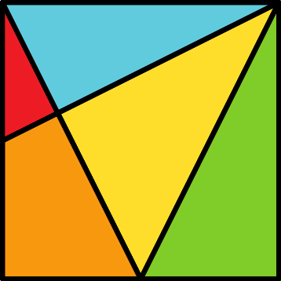

# The Egyptian Tangram

The Egyptian Tangram is a 5-piece square dissection with interesting mathematical features.

In this repository you can find:

* A pre-print of the article [**El tangram egipci: diari de disseny**](/El%20Tangram%20Egipci%20-%20Diari%20de%20Disseny/El%20tangram%20egipci%20-%20diari%20de%20disseny.pdf) (in catalan, *The Egyptian Tangram: Design Diary*) where we introduce this new tangram design and explained its main mathematical features. The final version of the article was published in:

Luna-Mota, C. (June 2019). «El racó del MMACA: El tangram egipci: diari de disseny». <a href="https://publicacions.iec.cat/PopulaFitxaArticle.do?idArticle=105410&moduleName=revistes_cientifiques&subModuleName=&idTipusConsulta=citacio"><em>Nou Biaix</em></a>, 44, 100-112.

* The slides used in the talk [**Parlem de tangrams: De la Xina a Egipte passant per Cornellà**](/Parlem%20de%20Tangrams%20-%20De%20la%20Xina%20a%20Egipte%20passant%20per%20Cornell%C3%A0/Parlem%20de%20tangrams.pdf) (in catalan, *Let's talk about tangrams: from China to Egypt passing through Cornellà*) that was performed in the Catalan Museum of Mathematics ([MMACA](http://mmaca.cat/)) on January 29th 2020.

* The **Egyptian Tangram Guide** (*under preparation*) an exhaustive compilation of all the mathematical properties of the Egyptian Tangram we are aware of (please submit new properties for inclusion in future versions of this guide).

* The [**Egyptian Tangram Print & Play flyer**](/The%20Egyptian%20Tangram%20-%20Printable%20Edition) (permission granted for personal or educational use only).

* The [**STL files**](/The%20Egyptian%20Tangram%20-%20STL) you need to print a copy of the Egyptian Tangram in a 3D printer (permission granted for personal or educational use only).

## License

The Egyptian Tangram design is **Copyright © 2019 Carlos Luna Mota. All Rights Reserved.**

Everything else is under a [Creative Commons By-NC-SA](https://creativecommons.org/licenses/by-nc-sa/4.0/) license.

Please, contact me if you are interested in producing/selling copies of the Egyptian Tangram.
